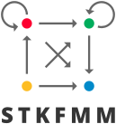

###

A C++ library implements the [Kernel Aggregated Fast Multipole Method](https://link.springer.com/article/10.1007/s10444-021-09896-1) based on the library PVFMM.

# What does it compute

It computes the classic kernel sum problem: for a given set of single layer sources  at points , double layer sources  points , target points , and single layer potential , double layer potential :
<p align="center"></p>

**Note** For some problems the kernels  and  may not be linear operators applied onto .

This package computes Laplace kernel  and Stokeslet kernel  and their derivatives.

Here is a detailed table, in which the summation  is dropped for clarity and the subscript indices  denote the tensor indices.
Einstein summation and comma notation are used to simplify the expressions, for example, .

In the table:

1. **NA** means input ignored
2. **Q*{ij}, D*{ij}** are 3x3 tensors written as 9-dimension vectors in row-major format
3.  is symmetric so it is written as .
4. For `RPY`, `StokesRegVel` and `StokesRegVelOmega` kernels, the parameter  and  can be different for each source point, and the summations are nonlinear functions of  and . Also  and  must be much smaller than the lower level leaf box of the adaptive octree, otherwise the convergence property of KIFMM is invalidated.
5. For all kernels, the electrostatic conductivity and fluid viscosity are ignored (set to 1).
6. The regularized Stokeslet is .
7. For Stokes `PVel`, `PVelGrad`, `PVelLaplacian`, and `Traction` kernels, the pressure and velocity fields are:
   $$
      p=\frac{1}{4 \pi} \frac{r_{j}}{r^{3}} f_{j} + \frac{1}{4 \pi}\left(-3 \frac{r_{j} r_{k}}{r^{5}}+\frac{\delta_{j k}}{r^{3}}\right) D_{j k}, \quad u_{i}=G_{ij}f_j + \frac{1}{8 \pi \mu}\left(-\frac{r_{i}}{r^{3}} trD\right) + \frac{1}{8 \pi \mu}\left[-\frac{3 r_{i} r_{j} r_{k}}{r^{5}}\right] D_{j k}
   $$

| Kernel              | Single Layer Source (dim)  | Double Layer Source (dim) | Summation                                       | Target Value (dim)                                                  |
| ------------------- | -------------------------- | ------------------------- | ----------------------------------------------- | ------------------------------------------------------------------- |
| `LapPGrad`          |  (1)                    |  (3)                   |                                 |  (1+3)                                                  |
| `LapPGradGrad`      |  (1)                    |  (3)                   |                                 |  (1+3+6).                               |
| `LapQPGradGrad`     |  (9)               | NA                        |                                |  (1+3+6).                               |
| `Stokes`            |  (3)                  | NA                        |                               |  (3)                                                           |
| `RPY`               |  (3+1)              | NA                        |    |  (3+3)                                            |
| `StokesRegVel`      |  (3+1)       | NA                        |                      |                                                                |
| `StokesRegVelOmega` |  (3+3+1) | NA                        | See Appendix A of doi 10.1016/j.jcp.2012.12.026 |  (3+3)                                                     |
| `PVel`              |  (3+1)            |  (9)              | see above                                       |  (1+3)                                                       |
| `PVelGrad`          |  (3+1)            |  (9)              | see above                                       |  (1+3+3+9)                                    |
| `PVelLapLacian`     |  (3+1)            |  (9)              | see above                                       |  (1+3+3)                                            |
| `Traction`          |  (3+1)            |  (9)              | see above                                       |  (9) |

# Features

- All kernels are hand-written with optimized SIMD intrinsic instructions.
- Singly, doubly and triply periodicity in a unified interface.
- Support no-slip boundary condition imposed on a flat wall through image method.
- Single Layer and Double Layer potentials are simultaneously calculated through a single octree.
- M2M, M2L, L2L operations are combined into single layer operations only.
- All PVFMM data structures are wrapped in a single class.
- Multiple kernels can be activated simultaneously.
- Complete MPI and OpenMP support.

# Usage

This library defines an abstract base class `STKFMM` for the common interface and utility functions. Two concrete derived classes `Stk3DFMM` and `StkWallFMM` are defined for two separate cases: 3D spatial FMM and Stokes FMM with no-slip boundary condition imposed on a flat wall.

For details of usage, look at the function `runFMM()` in `Test/Test.cpp`.

Instructions here.

### Step 0 Decide BC and Kernels to use

```cpp
PAXIS paxis = PAXIS::NONE; // or other bc
int k = asInteger(KERNEL::Stokes) | asInteger(KERNEL::RPY); // bitwise | operator, other combinations also work
```

### Step 1 Construct an object

Construct an STKFMM object, with chosen BC and kernels, depending on if you need the no-slip wall.

```cpp
std::shared_ptr<STKFMM> fmmPtr;
if (wall) {
    fmmPtr = std::make_shared<StkWallFMM>(p, maxPoints, paxis, k);
} else {
    fmmPtr = std::make_shared<Stk3DFMM>(p, maxPoints, paxis, k);
}
```

- `order`: number of equivalent points on each cubic octree box edge of KIFMM, usually chosen from . This affects the trade of between accuracy and computation time.
- `maxPts`: max number of points in an octree leaf box, usually . This affects the depth of adaptive octree, thus the computation time.
- `PAXIS::NONE`: the axis of periodic BC. For periodic boundary conditions, replace `NONE` with `PX`, `PXY`, or `PXYZ`.
- `KERNEL::PVel | KERNEL::LAPPGrad`: A combination of supported kernels, using the | `bitwise or` operator.

### Step 2 Specify the box and source/target points

```cpp
double origin[3] = {x0, y0, z0};
fmmPtr->setBox(origin, box);
```

- if both SL and DL points exist:

```cpp
fmmPtr->setPoints(nSL, point.srcLocalSL.data(), nTrg, point.trgLocal.data(), nDL, point.srcLocalDL.data());
```

- if no DL points:

```cpp
fmmPtr->setPoints(nSL, point.srcLocalSL.data(), nTrg, point.trgLocal.data());
```

- For `Stk3DFMM`, all points must in the cube defined by [x0,x0+box)[y0,y0+box)[z0,z0+box)
- For `StkWallFMM`, all points must in the half cube defined by [x0,x0+box)[y0,y0+box)[z0,z0+box/2), and the no-slip boundary condition is always imposed at the z0 plane.

### Step 3 Run FMM for one kernel:

```cpp
fmmPtr->setupTree(KERNEL::Stokes);
fmmPtr->evaluateFMM(kernel, nSL, value.srcLocalSL.data(), nTrg, trgLocal.data(), nDL, value.srcLocalDL.data());
```

- `nDL` and the values for DL sources will be ignored if the chosen kernel does not support DL.

# Supported kernels and boundary conditions

In these tables

- `SL Neutral` means the summation of each component of SL sources within the box must be zero
-  Neutral means the summation of  within the box must be zero
-  Neutral means the summation of trace of DL sources  within the box must be zero
- `Yes` means no requirements

### `Stk3DFMM`

| Kernel              | `PNONE` | `PX`                 | `PXY`                | `PXYZ`                  |
| ------------------- | ------- | -------------------- | -------------------- | ----------------------- |
| `LapPGrad`          | Yes     | SL Neutral           | SL Neutral           | SL Neutral              |
| `LapPGradGrad`      | Yes     | SL Neutral           | SL Neutral           | SL Neutral              |
| `LapQPGradGrad`     | Yes     | SL Neutral           | SL Neutral           | SL Neutral              |
| `Stokes`            | Yes     | SL Neutral           | SL Neutral           | Yes                     |
| `RPY`               | Yes     | SL Neutral           | SL Neutral           | Yes                     |
| `StokesRegVel`      | Yes     | SL Neutral           | SL Neutral           | Yes                     |
| `StokesRegVelOmega` | Yes     | SL Neutral           | SL Neutral           | Yes Neutral             |
| `PVel`              | Yes     | SL,  Neutral | SL,  Neutral | ,  Neutral |
| `PVelGrad`          | Yes     | SL,  Neutral | SL,  Neutral | ,  Neutral |
| `PVelLapLacian`     | Yes     | SL,  Neutral | SL,  Neutral | ,  Neutral |
| `Traction`          | Yes     | SL,  Neutral | SL,  Neutral | ,  Neutral |

### `StkWallFMM`

| Kernel   | `PNONE` | `PX` | `PXY` | `PXYZ` |
| -------- | ------- | ---- | ----- | ------ |
| `Stokes` | Yes     | Yes  | Yes   | No     |
| `RPY`    | Yes     | Yes  | Yes   | No     |

# Compile and Run tests:

## Prerequisite:

- Install the `develop` branch (b9de1a) of `pvfmm` by cmake. If you install `pvfmm` by gnu automake you will have to manually help `STKFMM` discover `pvfmm`.

If PVFMM is properly installed, you should be able to compile this project using the `CMakeLists.txt`. The script `do-cmake.sh` is an example of how to invoke `cmake` command with optional features (python interface and doxygen documentation).

To run the test driver, go to the build folder and type:

```bash
./Test/TestFMM.X --help
Test Driver for Stk3DFMM and StkWallFMM

Usage: ./Test/TestFMM.X [OPTIONS]

Options:
  -h,--help                   Print this help message and exit
  --config                    config file name
  -S,--nsl INT                number of source SL points
  -D,--ndl INT                number of source DL points
  -T,--ntrg INT               number of source TRG points
  -B,--box FLOAT              testing cubic box edge length
  -O,--origin [FLOAT,FLOAT,FLOAT]
                              testing cubic box origin point
  -K,--kernel INT             test which kernels
  -P,--pbc INT                periodic boundary condition. 0=none, 1=PX, 2=PXY, 3=PXYZ
  -M,--maxOrder INT           max KIFMM order, must be even number. Default 16.
  --eps FLOAT                 epsilon or a for Regularized and RPY kernels
  --max INT                   max number of points in an octree leaf box
  --seed INT                  seed for random number generator
  --dist [FLOAT,FLOAT]        parameters for the random distribution
  --type INT                  type of random distribution, Uniform = 1, LogNormal = 2, Gaussian = 3, Ellipse = 4
  --direct,--no-direct{false} run O(N^2) direct summation with S2T kernels
  --verify,--no-verify{false} verify results with O(N^2) direct summation
  --convergence,--no-convergence{false}
                              calculate convergence error relative to FMM at maxOrder
  --random,--no-random{false} use random points, otherwise regular mesh
  --dump,--no-dump{false}     write src/trg coord and values to files
  --wall,--no-wall{false}     test StkWallFMM, otherwise Stk3DFMM
```

For possible test options. Several test configuration files are included in the folder `Config`, and can be loaded by `TestFMM.X` as this:

```
./Test/TestFMM.X --config ../Config/Verify.toml
```

For large scale convergence tests of all possible BCs (roughly ~100GB of memory will be used and a lot of precomputed data will be generated for the first run):

```bash
./Test/TestFMM.X --config ../Config/BenchP0.toml
```

The options in the config toml file can be overridden by extra flags, for example, use other boundary conditions:

```bash
./Test/TestFMM.X --config ../Config/BenchP0.toml -P 1
./Test/TestFMM.X --config ../Config/BenchP0.toml -P 2
./Test/TestFMM.X --config ../Config/BenchP0.toml -P 3
```

`TestFMM.X` will write a `TestLog.json` file, which can be loaded into python for convenient performance/accuracy analysis and plotting.

**Note** If your machine's memory is limited (<24GB), use smaller number of points and test one kernel at a time.

## Optional:

`STKFMM` has a few optional features that can be turned on or off during the cmake configuration stage with the following switches:

```bash
  -D BUILD_TEST=ON \
  -D BUILD_DOC=OFF \
  -D BUILD_M2L=OFF \
  -D PyInterface=OFF \
```

By default, only the `BUILD_TEST` is turned on.

- If you need doxygen document, set `BUILD_DOC=ON`.
- If you want to generate periodicity precomputed `M2L` data yourself, set `BUILD_M2L=ON`. In this case you will have to install the linear algebra library `Eigen`. If you do not want to generate periodicity precomputed data yourself, you can download the `M2C.7z` file from `https://zenodo.org/record/6338525#.YijCaXrMJD8` and unzip all data files to folder `$PVFMM_DIR/pdata`.
- If you want to call this library from python, set `PyInterface=ON`. In this case you need some basic python facilities. Here is a basic example for `requirements.txt` used for python virtualenv:

```
argh==0.26.2
h5py==2.9.0
llvmlite==0.32.1
mpi4py==3.0.2
numba==0.49.1
numpy==1.18.4
scipy==1.4.1
six==1.15.0
```

# Acknowledgement

Dhairya Malhotra and Alex Barnett for useful coding instructions and discussions.
